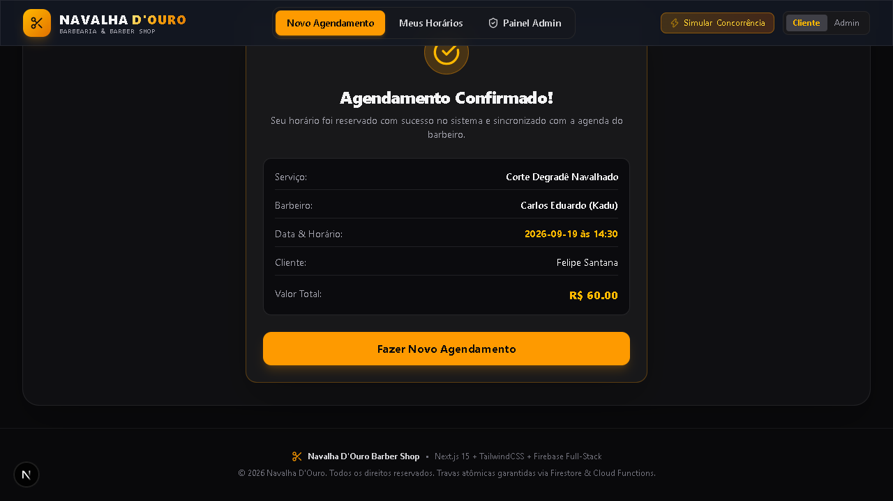
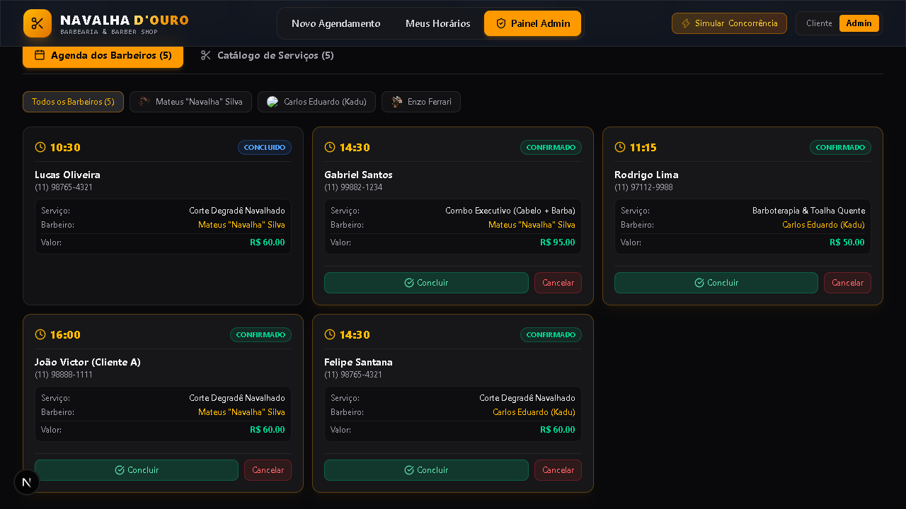
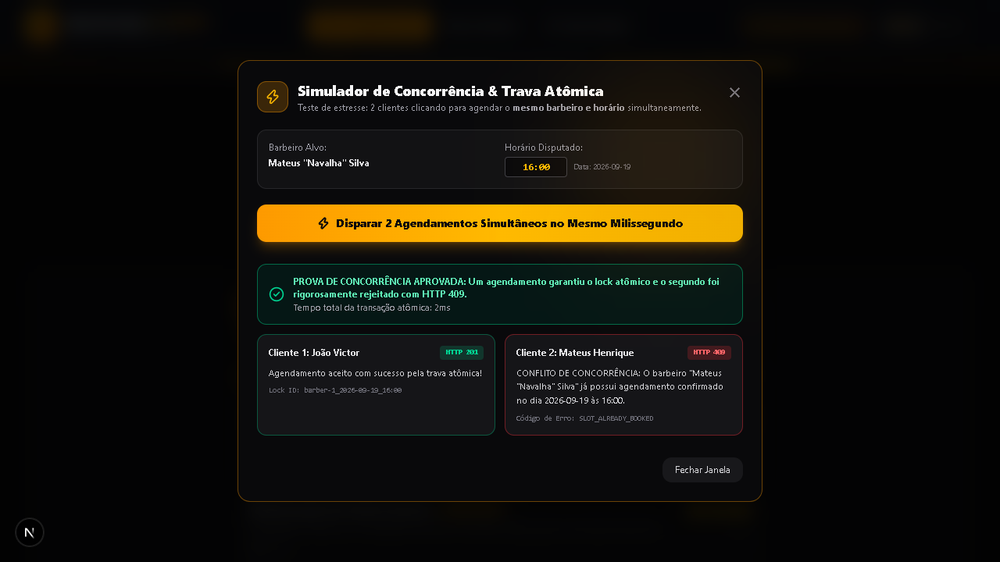

# Navalha D'Ouro — Sistema de Barbearia com Trava Atômica de Concorrência

> Plataforma completa de agendamento online para barbearias tradicionais, desenvolvida com foco em alta disponibilidade, transações atômicas anti double-booking e design editorial livre de clichês de IA.

---

## 🚀 Tecnologias e Stack

- **Framework Web:** [Next.js 16](https://nextjs.org/) (App Router, Server Components & Route Handlers)
- **Biblioteca de UI:** [React 19](https://react.dev/)
- **Linguagem:** [TypeScript 5](https://www.typescriptlang.org/) (Strict Mode)
- **Estilização:** [Tailwind CSS v4](https://tailwindcss.com/)
- **Validação de Esquemas & Sanitização:** [Zod](https://zod.dev/)
- **Testes Automatizados:** Test Runner Nativo do Node.js (`node:test`, `node:assert`)
- **Ícones:** [Lucide React](https://lucide.dev/)

---

## 🔒 Destaques Técnicos

1. **Trava Atômica de Concorrência (Anti Double-Booking):**
   - Garante matematicamente que dois clientes tentando agendar o mesmo barbeiro, data e horário no mesmo milissegundo nunca gerem agendamentos duplicados.
   - Uma requisição conquista a trava atômica (HTTP 201) e a segunda é rejeitada de imediato com HTTP 409 (`SLOT_ALREADY_BOOKED`).
2. **Arquitetura Desacoplada (Clean Architecture Pragmatic):**
   - UI separada de regras de negócio; todas as chamadas HTTP isoladas em `src/services/booking-api.ts`.
   - Componentes modulares aderentes ao Princípio da Responsabilidade Única (SRP), todos abaixo de 200 linhas.
3. **Segurança Reforçada:**
   - Validação rigorosa de esquemas de entrada com Zod.
   - Sanitização de strings contra ataques XSS.
   - Rate limiting por IP em memória para proteção de endpoints públicos.
   - Cabeçalhos de segurança HTTP configurados (`X-Frame-Options: DENY`, `X-Content-Type-Options: nosniff`, `Referrer-Policy`).
4. **UI & Design Anti-IA:**
   - Paleta quente e editorial (carvão nobre `#0c0e12` com âmbar clássico).
   - Sem gradientes clichês ou ícones decorativos sem função.
   - Totalmente acessível e responsivo.

---

## 🛠️ Instalação e Execução

### Pré-requisitos
- Node.js 20+ instalado
- npm ou yarn

### 1. Clonar o repositório e instalar dependências
```bash
git clone <url-do-repositorio>
cd barbearia
npm install
```

### 2. Configurar Variáveis de Ambiente
```bash
cp .env.example .env.local
```

### 3. Executar o Servidor de Desenvolvimento
```bash
npm run dev
```
Acesse [http://localhost:3000](http://localhost:3000) no seu navegador.

---

## 🧪 Catálogo de Comandos e Scripts

| Comando | Descrição |
| :--- | :--- |
| `npm run dev` | Inicia o servidor local Next.js em modo desenvolvimento |
| `npm run build` | Compila o projeto otimizado para produção |
| `npm run start` | Inicia o servidor em modo de produção |
| `npm run lint` | Executa o ESLint verificando regras de qualidade e React 19 |
| `npm run type-check` | Executa a verificação estrita de tipos do TypeScript (`tsc --noEmit`) |
| `npm run test` | Executa a suíte de testes unitários automatizados (`node:test`) |
| `npm run test:concurrency` | Executa o teste de estresse simulando 2 cliques simultâneos no servidor |

---

## 📸 Telas da Aplicação

| Agendamento & Confirmação | Painel de Gestão (Admin) |
| :---: | :---: |
|  |  |

| Simulação de Concorrência Atômica | Visão Responsiva Mobile |
| :---: | :---: |
|  |  |

---

## 📐 Documentação de Arquitetura

Para mais detalhes sobre as decisões arquiteturais (ADRs), controle de transação atômica e catálogo detalhado de rotas da API, consulte o arquivo [ARCHITECTURE.md](./ARCHITECTURE.md).
